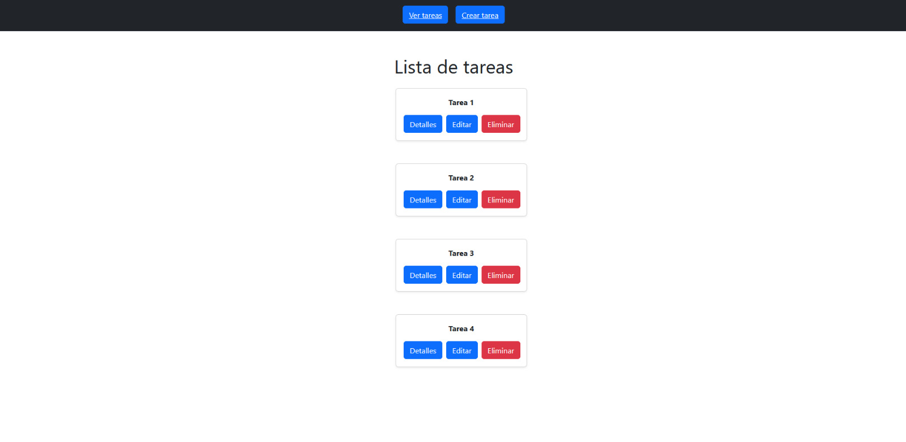
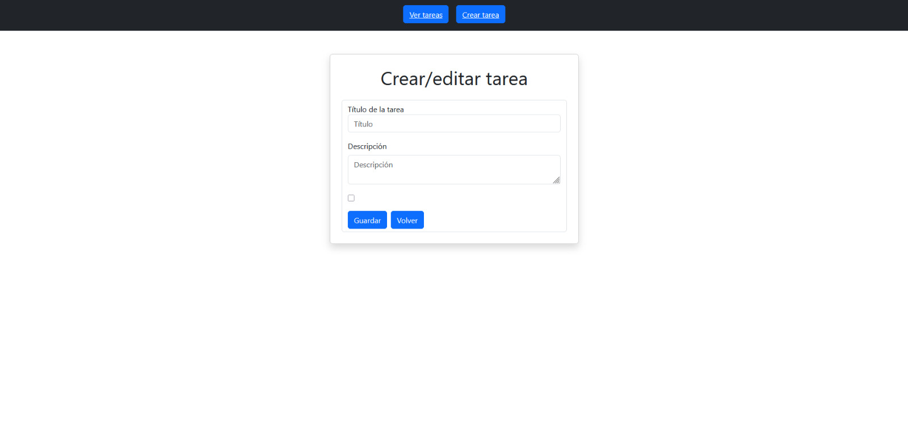
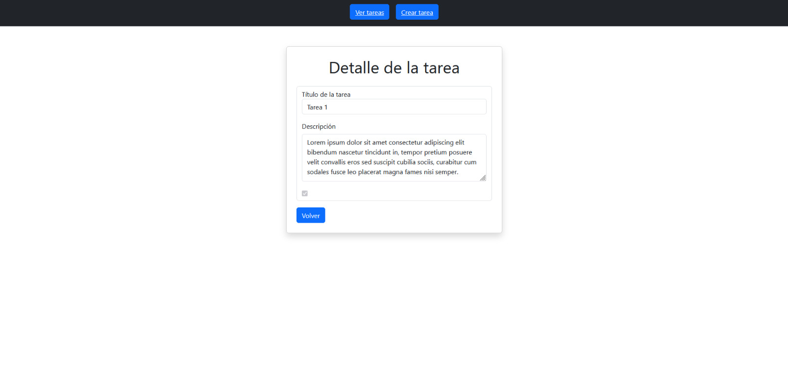

# Administrador de Tareas (Prueba Técnica)

Aplicación construida para la prueba técnica de ForIT.

## Tecnologías

* **Frontend:** React, Vite, JavaScript.
* **Backend:** Node.js, Express.
* **Base de Datos:** SQLite.
* **Linter:** ESLint.

---

## Como ejecutar

### 1. Clonar el repositorio
```bash
git clone <https://github.com/NehuenLian/prueba-tecnica-for-it>
cd prueba-tecnica-forit
```

### 2. Configurar el backend
```bash
cd backend
npm install
npm run dev
```

### 3. Configurar el frontend
```bash
cd frontend
npm install
```

### 4. Crear archivo .env con la URL del backend (ver `.env.example`):
```text
VITE_API_URL=http://localhost:3000/api/tasks
```

### 4. Iniciar el frontend
```bash
npm run dev
```

# Screenshots
A continuación se muestran imágenes del funcionamiento de los principales módulos:

### Listado de tareas


### Formulario de Creación / Edición


### Detalle de tarea individual


---

Autor: Nehuen Lián https://github.com/NehuenLian
